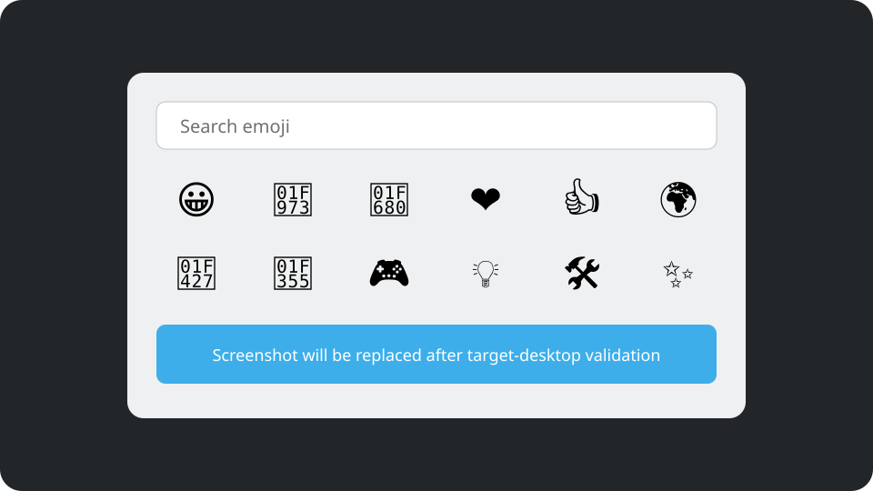

# Emoji Palette for Fcitx 5

Emoji Palette for Fcitx 5 is a native, keyboard-driven emoji picker for Linux
desktops. It commits the selected text through the original Fcitx input
context, without changing the clipboard or simulating keyboard input.

The first public prerelease targets Bazzite 44 and Fedora 44 with KDE Plasma 6
on Wayland. It is not yet recommended for production use because the complete
desktop manual test matrix has not been executed.



## Features

- Search across 3,944 fully-qualified Unicode Emoji 17.0 sequences.
- English, German, and Russian CLDR 48.2 names and keywords.
- Categories, recent selections, favorites, and skin-tone variants.
- Keyboard navigation while focus remains in the source application.
- Native `InputContext::commitString()` insertion through Fcitx 5.
- Clipboard-independent operation with no synthetic input.
- Non-activating LayerShellQt palette on Wayland.
- Caret-relative placement on every Fcitx5 frontend that reports a cursor
  position, with a documented active-output fallback where none exists
  (see *Picker placement*).
- Bounded, versioned, replay-resistant D-Bus protocol between the addon and
  the crash-isolated Qt helper.
- Atomic user-state writes and recovery from a damaged state file.
- Labelled placeholders instead of missing-glyph boxes for emoji the
  installed font cannot draw.

## Requirements

- Fcitx 5.1 or newer
- libxkbcommon 1.0 or newer
- Qt 6.6 or newer
- LayerShellQt 6.6 or newer
- Noto Color Emoji, or another emoji font (see *Emoji font coverage*)
- A Wayland compositor with `wlr-layer-shell` support for the primary path

The X11 fallback uses a non-focusable tool window, but the first prerelease is
validated primarily for KDE Plasma on Wayland.

## Emoji font coverage

The catalog is fixed at Unicode Emoji 17.0 and does not depend on the installed
font. Which entries can be *drawn* does depend on it, because emoji fonts follow
their own release schedule.

`google-noto-color-emoji-fonts-20250623`, current on Fedora 44 and Bazzite 44,
stops at Emoji 16.0. Seven Emoji 17.0 code points therefore have no glyph:
U+1F6D8, U+1FA8A, U+1FA8E, U+1FAC8, U+1FACD, U+1FAEA and U+1FAEF. Sixty-seven
catalog entries reference them, most of them wrestling sequences joined by
U+1FAEF.

Rather than hiding those entries or shipping a font, the picker detects real
glyph availability through the Qt font fallback chain and draws a dashed
placeholder tile labelled with the missing code point, for example `1FAEA`. The
localized name stays in the tooltip, the status line and the accessible text,
together with a note that the installed emoji font has no glyph.

Selecting such an entry commits the exact original Unicode sequence, unchanged.
Placeholders disappear on their own once the installed emoji font gains the
glyphs; nothing needs to be reconfigured.

See `docs/adr/0005-font-coverage-fallback.md` for the full decision.

## Install on Fedora

Download the binary RPM for your architecture from the
[latest release](https://github.com/x-vlad-x/fcitx5-emoji-palette/releases),
then install it:

```bash
sudo dnf install ./fcitx5-emoji-palette-0.1.0-rc.2-1.fc44.x86_64.rpm
fcitx5 -r
```

Log out and back in if the running Fcitx instance does not discover the addon
after a restart.

## Install on Bazzite

This addon must run inside the host Fcitx process, so a Flatpak or Distrobox
package cannot provide the required integration. Layer the downloaded RPM:

```bash
sudo rpm-ostree install ./fcitx5-emoji-palette-0.1.0-rc.2-1.fc44.x86_64.rpm
systemctl reboot
```

Local RPMs do not update automatically. Package layering can also delay or
block an operating-system update if dependencies become incompatible. See the
[Bazzite packaging guide](docs/packaging.md#bazzite) for updates, removal,
rollback, and the custom-image alternative.

## Use

1. Place the text cursor in an application supported by Fcitx 5.
2. Press `Super+.` to open the palette.
3. Type to search, use the arrow keys to move, and press `Enter` or `Space` to
   insert.
4. Press `Escape` to cancel.

Additional controls:

| Key | Action |
| --- | --- |
| `Tab` and `Shift+Tab` | Move between categories |
| `Home` and `End` | Move to the first or last result |
| `Page Up` and `Page Down` | Move by one visible page |
| `Ctrl+D` | Toggle the selected emoji as a favorite |
| `Ctrl+V` | Show variants for the selected emoji |
| `Backspace` | Remove the final search character |

Pointer selection is supported without transferring keyboard focus to the
palette. The trigger and close-after-selection behavior are configurable in
the Fcitx 5 configuration tool under **Addons → Emoji Palette**.
Configured trigger letters follow their physical key when the active keyboard
layout changes, so a single `Super+Z` binding also works from a Russian layout.

The grid-settings button expands controls inside the picker without creating a
focusable popup. The first `Escape` press or pointer press elsewhere inside the
picker closes only those controls. Clicking another application follows the
normal source-focus rule and cancels the picker if the original input context
loses focus.

## Picker placement

The picker opens next to the text caret whenever the Fcitx 5 frontend serving
the focused application reports a cursor position. It opens below the caret,
above it when there is no room below, on the monitor that holds the caret, and
always inside the usable area of that monitor. The client scale factor is
applied, so placement is correct at 125%, 150% and other fractional scaling
factors.

Native Wayland applications do not provide a caret position. The Wayland
input-method protocols deliberately withhold global caret coordinates from the
input method, and the only protocol that solves this,
`zwp_input_popup_surface_v2`, can be used only by the process that owns the
Wayland input-method connection, which is Fcitx 5 itself rather than this
crash-isolated helper. For those applications the picker is centered on the
active monitor. This is the documented fallback and is not a misconfiguration.

Caret-relative placement is therefore active for X11 and XWayland applications,
including applications configured with the Fcitx 5 Qt or GTK input-method
modules (`QT_IM_MODULE=fcitx`, `GTK_IM_MODULE=fcitx`) under XWayland, and for
any other frontend that reports an absolute cursor rectangle. Those input-method
modules report a window-relative rectangle when the application itself runs on
Wayland, which no separate process can resolve, so those applications receive
the centered fallback as well.

To see which path an application takes, enable the addon's diagnostic log
category. Fcitx 5 log levels are numeric and `5` is debug:

```bash
busctl --user call org.fcitx.Fcitx5 /controller \
  org.fcitx.Fcitx.Controller1 SetLogRule s 'emojipalette=5'
```

The same rule can be passed at startup with `fcitx5 --verbose 'emojipalette=5'`.
Each activation then logs the frontend name, the raw cursor rectangle, the
scale factor, and whether the caret was usable:

```text
Show frontend=wayland rawCaret=0,0,0,0 relativeRect=0 clientScalePercent=100 caretUsable=0
Show frontend=dbus rawCaret=782,302,2,26 relativeRect=0 clientScalePercent=100 caretUsable=1
```

The helper logs the placement it derived under
`org.fcitx.EmojiPalette.placement`, which reports the converted caret, the
chosen output, and the final position:

```bash
QT_LOGGING_RULES='org.fcitx.EmojiPalette.placement=true' \
  /usr/libexec/fcitx5-emoji-palette-ui
```

Search text and selected emoji are never logged. See
`docs/adr/0006-caret-relative-placement.md` for the full rationale.

## Privacy and security model

The helper can request only a Unicode string associated with the active
transaction. It cannot access an Fcitx input context or commit text directly.
The addon binds each transaction to a tracked source context and cancels it on
focus loss, reset, input-method switch, context destruction, helper loss, or
protocol failure.

No network access is required at runtime. Normal builds use committed Unicode
data and do not download data during configuration or compilation.

## Build from source

Fedora 44 development dependencies:

```bash
sudo dnf install cmake ninja-build gcc-c++ python3 fcitx5-devel \
  libxkbcommon-devel \
  qt6-qtbase-devel qt6-linguist qt6-qttools-devel layer-shell-qt-devel
```

Build and test:

```bash
cmake --preset debug
cmake --build --preset debug
ctest --preset debug
```

Install to a staging directory before a system installation:

```bash
DESTDIR="$PWD/stage" cmake --install build/debug
find "$PWD/stage" -type f -print
```

See [Contributing](CONTRIBUTING.md) for quality gates,
[Unicode data maintenance](docs/unicode-data.md) for the explicit data update
process, and [Architecture](docs/architecture.md) for runtime design.

## Status

Automated compiler, sanitizer, static-analysis, protocol, Unicode generator,
UI-session, package validation, and RPM build gates are provided in CI. The
target-desktop scenarios in the [manual test matrix](docs/manual-test-matrix.md)
remain release evidence that must be collected on real systems.

Bug reports and compatibility evidence are welcome in
[GitHub Issues](https://github.com/x-vlad-x/fcitx5-emoji-palette/issues).
Security reports must follow [SECURITY.md](SECURITY.md).

## License

Project code is licensed under GPL-3.0-or-later. Generated emoji data is
licensed under Unicode-3.0. Desktop and AppStream metadata are licensed under
CC0-1.0. See [third-party notices](THIRD_PARTY_NOTICES.md) and the complete
license texts in `LICENSES/`.
